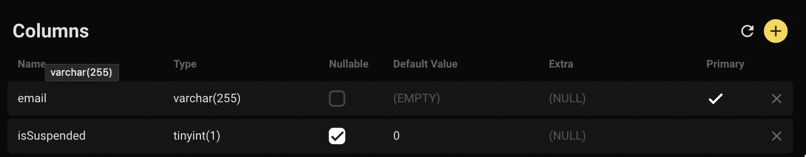
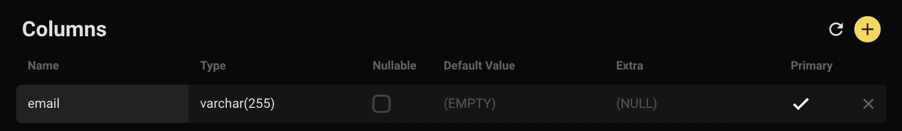
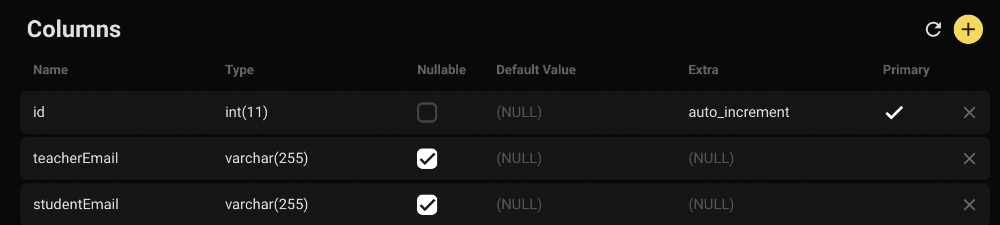
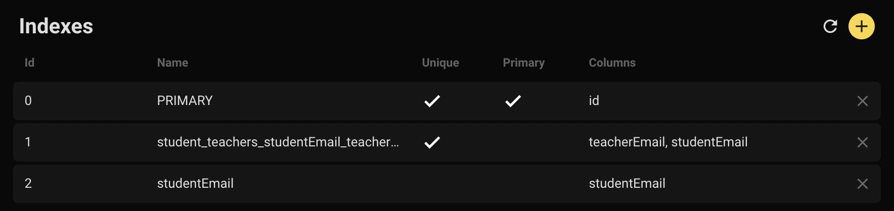
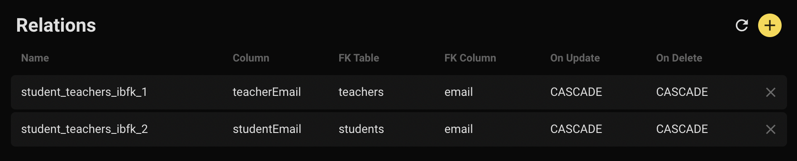

# NodeJS Assignment

## Info

Teachers need a system where they can perform administrative functions for their students. Teachers and students are identified by their email addresses.

---

## Techstack

1. NodeJS with express
2. MySQL Database
3. Sequelize ORM
4. Chai, Sinon for unit testing
5. Morgan for basic HTTP logging

## Deployment

Heroku and ClearDB

URL: [App Base URL](https://govtech-node-mysql.herokuapp.com/)

---

## Database Schema

### Table: `Students`



### Table: `Teachers`



### Table: `Student_teachers`





---

# User Stories + Live Routes

### 1. As a teacher, I want to register one or more students to a specified teacher.

A teacher can register multiple students. A student can also be registered to multiple teachers.

- Endpoint: `POST https://govtech-node-mysql.herokuapp.com/api/register`
- Headers: `Content-Type: application/json`
- Success response status: HTTP 204
- Request body example:

```
{
  "teacher": "teacherken@gmail.com"
  "students":
    [
      "studentjon@gmail.com",
      "studenthon@gmail.com"
    ]
}
```

### 2. As a teacher, I want to retrieve a list of students common to a given list of teachers (i.e. retrieve students who are registered to ALL of the given teachers).

- Endpoint: `GET https://govtech-node-mysql.herokuapp.com/api/commonstudents`
- Success response status: HTTP 200
- Request example 1: `GET /api/commonstudents?teacher=teacherken%40gmail.com`
- Success response body 1:

```
{
  "students" :
    [
      "commonstudent1@gmail.com",
      "commonstudent2@gmail.com",
      "student_only_under_teacher_ken@gmail.com"
    ]
}
```

- Request example 2: `GET https://govtech-node-mysql.herokuapp.com/api/commonstudents?teacher=teacherken%40gmail.com&teacher=teacherjoe%40gmail.com`
- Success response body 2:

```
{
  "students" :
    [
      "commonstudent1@gmail.com",
      "commonstudent2@gmail.com"
    ]
}
```

### 3. As a teacher, I want to suspend a specified student.

- Endpoint: `POST https://govtech-node-mysql.herokuapp.com/api/suspend`
- Headers: `Content-Type: application/json`
- Success response status: HTTP 204
- Request body example:

```
{
  "student" : "studentmary@gmail.com"
}
```

### 4. As a teacher, I want to retrieve a list of students who can receive a given notification.

A notification consists of:

- the teacher who is sending the notification, and
- the text of the notification itself.

To receive notifications from e.g. 'teacherken@gmail.com', a student:

- MUST NOT be suspended,
- AND MUST fulfill _AT LEAST ONE_ of the following:
  1. is registered with “teacherken@gmail.com"
  2. has been @mentioned in the notification

The list of students retrieved should not contain any duplicates/repetitions.

- Endpoint: `POST https://govtech-node-mysql.herokuapp.com/api/retrievefornotifications`
- Headers: `Content-Type: application/json`
- Success response status: HTTP 200
- Request body example 1:

```
{
  "teacher":  "teacherken@gmail.com",
  "notification": "Hello students! @studentagnes@gmail.com @studentmiche@gmail.com"
}
```

- Success response body 1:

```
{
  "recipients":
    [
      "studentbob@gmail.com",
      "studentagnes@gmail.com",
      "studentmiche@gmail.com"
    ]
}
```

In the example above, studentagnes@gmail.com and studentmiche@gmail.com can receive the notification from teacherken@gmail.com, regardless whether they are registered to him, because they are @mentioned in the notification text. studentbob@gmail.com however, has to be registered to teacherken@gmail.com.

- Request body example 2:

```
{
  "teacher":  "teacherken@gmail.com",
  "notification": "Hey everybody"
}
```

- Success response body 2:

```
{
  "recipients":
    [
      "studentbob@gmail.com"
    ]
}
```
